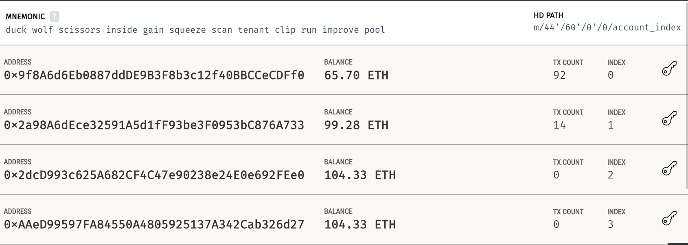
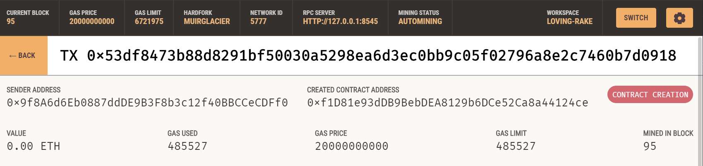

# Solidity

This project illustrates the level to which smart contracts can be used to distribute the equity in a company to its employees. There are three examples used:

1. Pay your Associate-level employees quickly and easily.

2. Distribute profits to different tiers of employees.

3. Distribute company shares for employees in a "deferred equity incentive plan" automatically.

### Contract 1

For the Associate Level Split contract, three addresses are selected as employee addresses and one address in ethereum is used as the owner account. Once the contract is deployed in the network, the address through which the contract is being deployed is selected as the owner address and is stored in that variable. Every time the contract is being called form any other address, it will be stored in the instance variable and compared woth the address in the owner variable to validate if the owner is using the account. Only, owner of the contract has the rights to deposit in the contract.

This contract splitts the deposit amount equally to all the employee addresses and as Solidity does not support float values, if there is any amount left after the division, it is sent back to the owner. At any point of time, the balance ion the contract will be zero as all the deposits are distributed to the employees.

The remix inputs while deploying the contract:

Transaction confirmation for contract deployment:

Initial account balances:

Transaction confirmation for ETH deposit:

Final account balances:

### Contract 2

For Tiered Split Contract, even though the process of selecting employee addresses and the qwner address stay the same, the logic of deposition changes. Here, the employees belong to different tiers and so, they get a different amount of money from the deposits. It is based on percentage values, so, points are calculated on the total amount for easier calculation. Each ether that wants to be deposited is converted into points bu dividing the amount by 100. Then for respective tier employees, the percentage value is multiplied to the points to get the appropriate amount to be deposited into account.

In this example, the different percentage values are 60%, 25%, and 15%. After calculating the points on the ether amount to be deposited, respective percentage values are calculated for all the three employee addresses and then the amount us deposited in to the accounts. After calculating each amounts, the values are added and stored in a variable to be compared with the initial value. If there is any wei remaining in the contract due to division overflow, it is then transfered to the owner account.

Transaction confirmation for contract deployment:

Initial account balances:

Transaction confirmation for ETH deposit:

Final account balances:

### Contract 3

The Deferred Equity Plan Contract is different from the above contracts because it is shares that is being deposited and not ether. In this set-up, employees receive shares for joining and staying with the firm. They may receive, for example, an award of 1,000 shares when joining, but with a 4 year vesting period for these shares. This means that these shares would stay with the company, with only 250 shares (1,000/4) actually distributed to and owned by the employee each year. If the employee leaves within the first 4 years, he or she would forfeit ownership of any remaining (“unvested”) shares.

In this contract total number of shares that an employee receive are decided to be 1000 and each year 250 shares are vested until all the shares are given to the employee. The time of when the contact is deployed is taken in the variable called now and a lock period of one year i.e, 365 days is added to the variable. So, when ever the time the contract is being pulle dis less than the time in the variable, the contract wouls not run. This is to avoid depositing the same employee multiple times in a year. After all the shares are deposited, the distributed shares variable will be 100 and then the contract would be complete and will not be executed for the same employee again.

In thihs contract the fall back function would be not to send ether to the contract as the contract would not accept any ether.

Metamask transaction for the contract:

Remix inputs for contract deployment:

Transaction confirmation for contract deployment:

